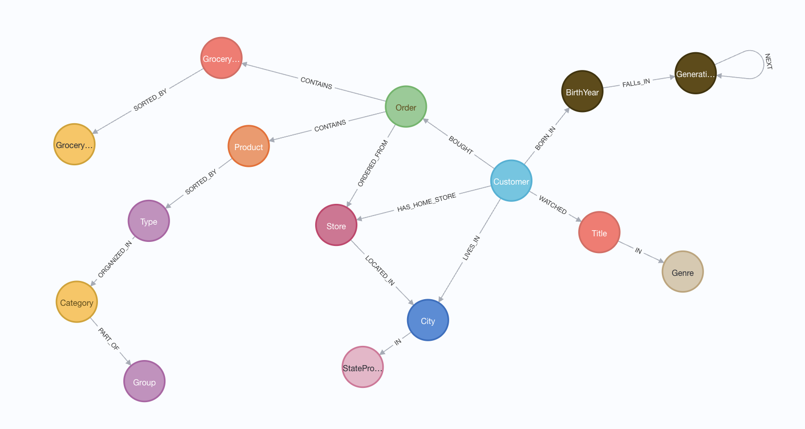

= Wielding Data for Good and Evil

This data is sourced from a few locations and pulled together for analysis in a graph database.

* https://www.kaggle.com/datasets/ylchang/coffee-shop-sample-data-1113[Kaggle Coffee Shop data^]
* https://www.kaggle.com/datasets/andrexibiza/grocery-sales-dataset[Grocery Sales Database^]
* https://www.kaggle.com/datasets/victorsoeiro/netflix-tv-shows-and-movies[Kaggle Netflix data set^]

== Data Model

== Presentations

PDF versions of accompanying presentations are published to SpeakerDeck.

* https://speakerdeck.com/jmhreif/interpreting-data-wielding-data-for-good-and-evil-in-the-ai-era-81cf6a0f-ce66-47f2-92df-bc1bea1d0fda[KCDC 2025^]
