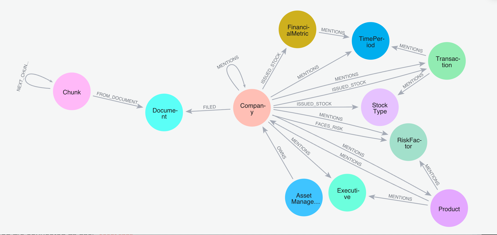

:readme:
:sectnums:
:img: ./img

= SEC Edgar 10-k financial filings

This data is sourced from public financial filings for companies in the US. It is a refined subset that has been curated for a Generative AI workshop specifically for a GraphRAG use case.

For the full workshop, check out the free, online course on https://graphacademy.neo4j.com/courses/workshop-genai/[Neo4j Graphacademy^].

== Data Model

*Note:* Some additional relationships in the above model have been hidden for easier reading.