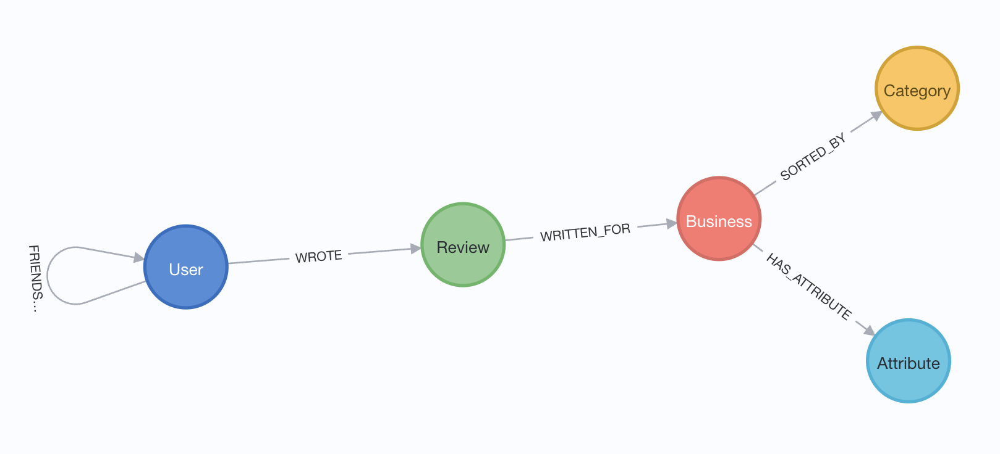

:readme:
:sectnums:
:img: ./img

= Yelp data (St. Louis businesses)

This data is sourced from the https://business.yelp.com/data/resources/open-dataset/[Yelp business open data set^], which contains JSON files of data from Yelp with businesses, reviews, users, and more.

== Data Model

There is currently one size/rendition of data set available in this repository (but you can customize business locations by tweaking the initial `WHERE` clause in the Cypher script):

* `St. Louis` businesses - a subset of the full data set with businesses that have an address of `St. Louis`, `Saint Louis`, or `St Louis`.

== AI Embeddings

There is a separate script to load embeddings for the Review text properties. You will need an API key for an embedding model.
